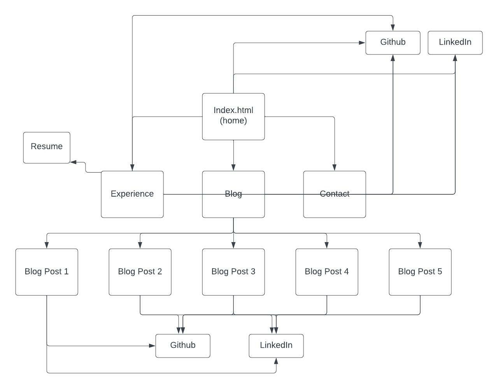
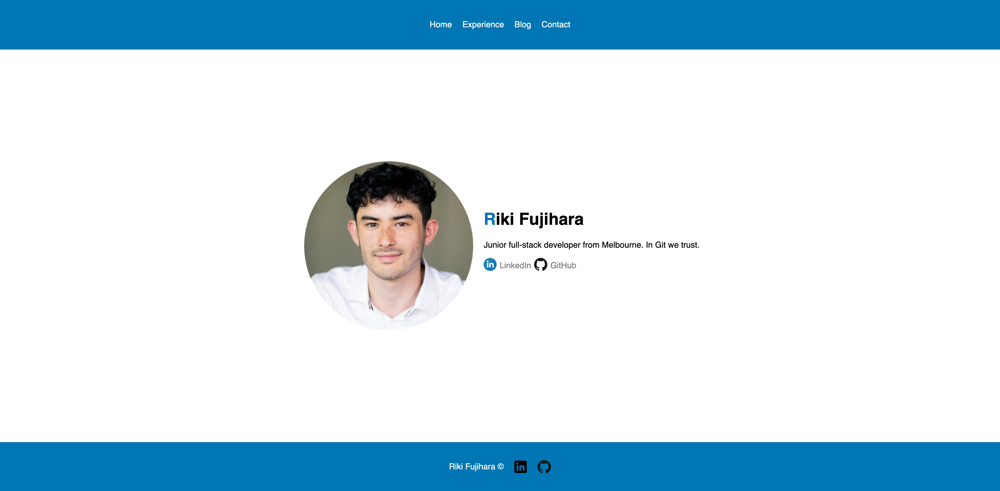

# General Project Documentation

## Published portfolio website <a href="https://rikifujihara-web.s3.ap-southeast-2.amazonaws.com/submission+Zip/src/html/index.html">here</a>

## Link to Github Repo <a href="https://github.com/rikifujihara">here</a>

 

# Riki Fujihara Portfolio Website

## Purpose
The purpose of this portfolio website is to showcase the relevant skills and experience of Riki Fujihara. The website will present him to potential employers as an IT professional.

## Functionality/features

This website is fully responsive for desktop, tablet and mobile viewport widths. Images, text and containers all resize depending on the viewport width and height so that they remain clear to the reader. The links on the website also respond to the user's mouse (hover effects) which indicates to the user that the content is clickable. The navigation bar contains links to all of the major pages so that they can be accessed from anywhere in the website. All clickable content on the site can be selected using the tab key.

## Sitemap

## Target Audience

The target audience of this portfolio website is employers in the IT industry searching for talented professionals.

## Tech Stack

This portfollio uses HTML as its markup language and seperate CSS files for styling. The deployment platform is Amazon Web Service's S3. Flexbox was the main CSS technology used for layout. Git was also used to maintain the project and to store a backup of the project in a remote repository (GitHub). An XML sitemap has also been included in the root directory of the project

## Screenshots

